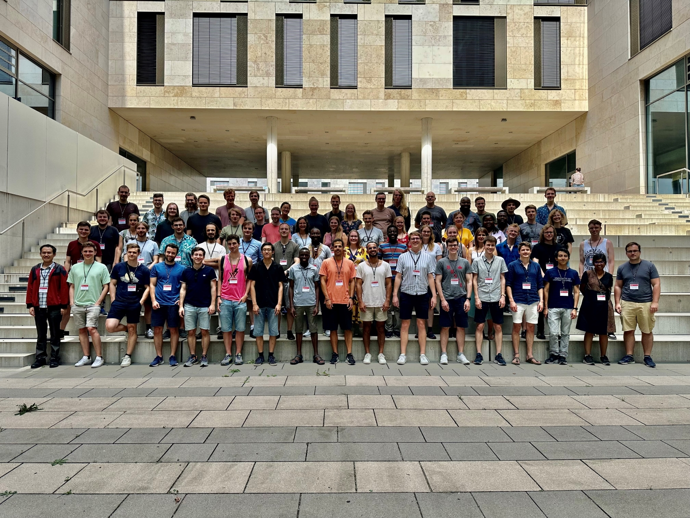

**18. Doktorand:innentreffen der Stochastik 2023** 

The 18. Doktorand:innentreffen der Stochastik will take place 21.08. - 23.08.23 (Monday-Wednesday) at the University of Heidelberg. This annual meeting is organised by and for doctoral students in the fields of probability theory and statistics and will be held in Heidelberg for the first time this year.
We offer doctoral students a platform to present their research areas and results, gain insights into other interesting research areas in their field, and exchange ideas with others.
The organisers Bianca Neubert, Ricardo Blum, Henning Stein and Maximilian Siebel look forward to meeting you at University of Heidelberg!
Please note that the number of participants is limited and registration is required.

**Link:** [https://stat.math.uni-heidelberg.de/dts2023/index.html](https://stat.math.uni-heidelberg.de/dts2023/index.html)

*[HTML]: HyperText Markup Language
*[CSS]: Cascading Style Sheets
*[JS]: JavaScript
